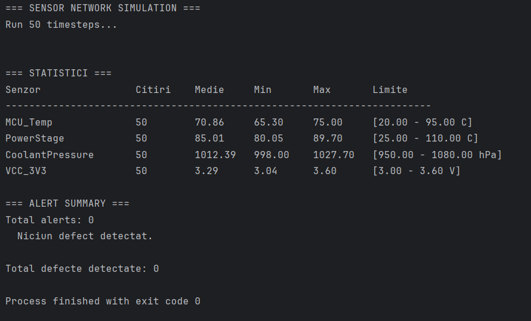

# Sensor Monitoring & Fault Detection System

Embedded-style simulation of a sensor network on a control board. Reads multiple sensors (temperature, pressure, voltage), logs the data, and triggers fault alerts when readings exceed safety thresholds.

Built in **C++17** to practice core OOP concepts: abstraction, polymorphism, encapsulation and composition.

## What it simulates

A control board (think automotive inverter or industrial controller) with 4 sensors:

| Sensor | Normal | Faulty if |
|---|---|---|
| MCU temperature | 70 °C | < 20 or > 95 |
| Power stage temperature | 85 °C | < 25 or > 110 |
| Coolant pressure | 1013 hPa | < 950 or > 1080 |
| VCC 3.3V rail | 3.3 V | < 3.0 or > 3.6 |

Each sensor produces a realistic reading (base value + random noise). The system runs for 50 timesteps, logs everything, and reports any fault detected during the run.

## OOP concepts demonstrated

- **Abstraction** — `Sensor` is an abstract base class with pure virtual `read()` and `getUnit()`
- **Polymorphism** — `SensorNetwork` holds `Sensor*` pointers and calls `read()` uniformly across derived types
- **Inheritance** — `TemperatureSensor`, `PressureSensor`, `VoltageMonitor` extend `Sensor`
- **Encapsulation** — `DataLogger` and `AlertSystem` hide internal state behind methods
- **Composition** — `SensorNetwork` contains `DataLogger`s and an `AlertSystem` (has-a, not is-a)

## Build & run

```bash
mkdir build && cd build
cmake ..
cmake --build .
./SensorMonitoring
```

Or open in CLion — it reads `CMakeLists.txt` automatically.

## Example output



Statistics after 50 timesteps: each sensor reports its average, min and max readings with the configured safety thresholds. Faults are logged in the alert summary when a reading falls outside the thresholds.
